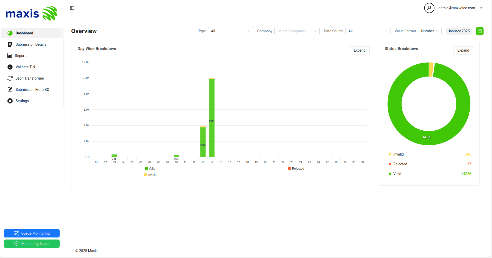
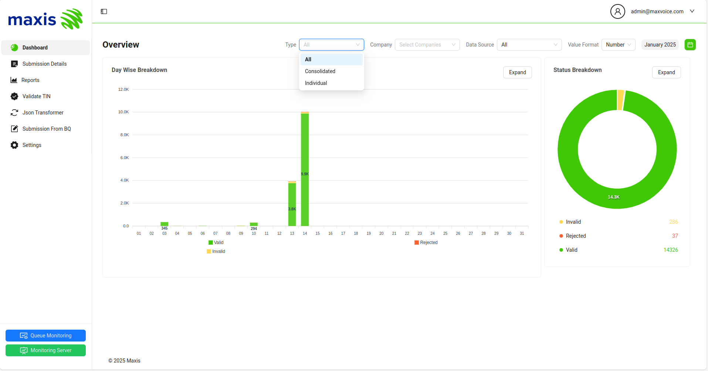

# Dashboard

The Maxis E-Invoice Portal Dashboard provides a comprehensive overview of invoicing activities. It includes various sections and visualizations to help you monitor and manage invoices effectively.

## Overview

The Dashboard is divided into several key sections:

### 1. Summary Cards

The summary cards at the top of the dashboard provide a quick overview of key metrics such as the total number of invoices, total amount, and other relevant statistics.

### 2. Invoices by Type

This section includes a dropdown selector that allows you to filter invoices by their types (e.g., Individual, Consolidated). This feature helps you quickly identify and analyze the proportion of invoices in each type.

### 3. Monthly Invoicing Trends

The bar chart in this section shows the monthly invoicing trends, allowing you to track the number of invoices and the total amount invoiced over time. This helps you identify patterns and trends in your invoicing activities.

### 4. Top Customers

This section lists your top customers based on the total amount invoiced. It helps you identify your most valuable customers and monitor their invoicing activities.

### 5. Recent Invoices

The recent invoices section provides a list of the most recent invoices, including details such as the invoice number, customer name, amount, and status. This allows you to quickly access and review your latest invoices.

### 6. Invoices by Category

This section displays a pie chart showing the distribution of invoices by category (e.g., Services, Products). This helps you understand the composition of your invoicing activities.

## Interactivity

The Dashboard is interactive, allowing you to filter and drill down into the data. You can click on different sections of the charts to view more detailed information and apply filters to customize the data displayed.

## Conclusion

The Maxis E-Invoice Portal Dashboard provides a powerful and intuitive interface for monitoring and managing your invoicing activities. By leveraging the visualizations and interactive features, you can gain valuable insights into your invoicing performance and make informed decisions to optimize your invoicing processes.