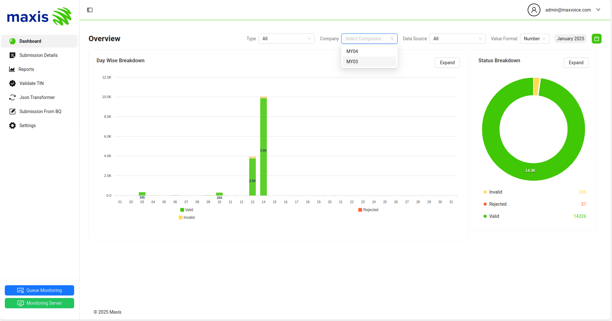
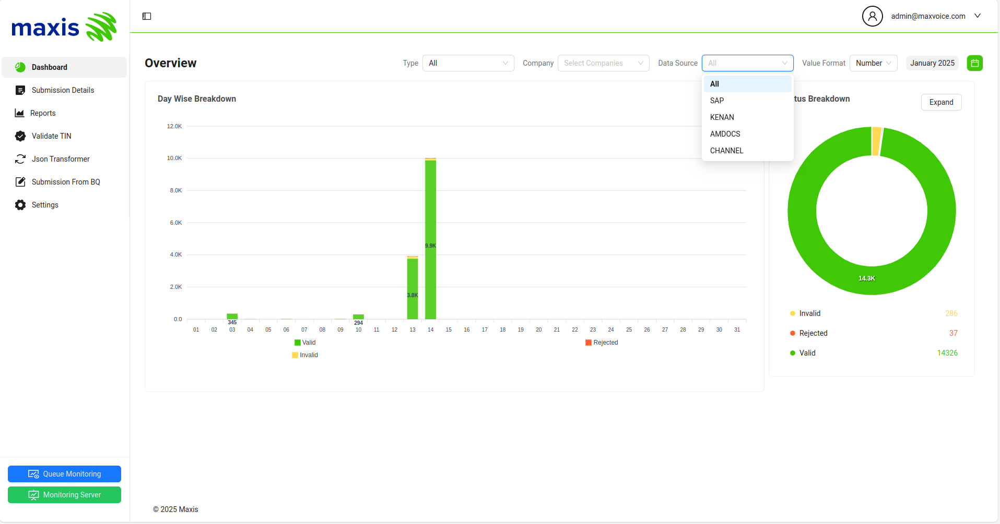
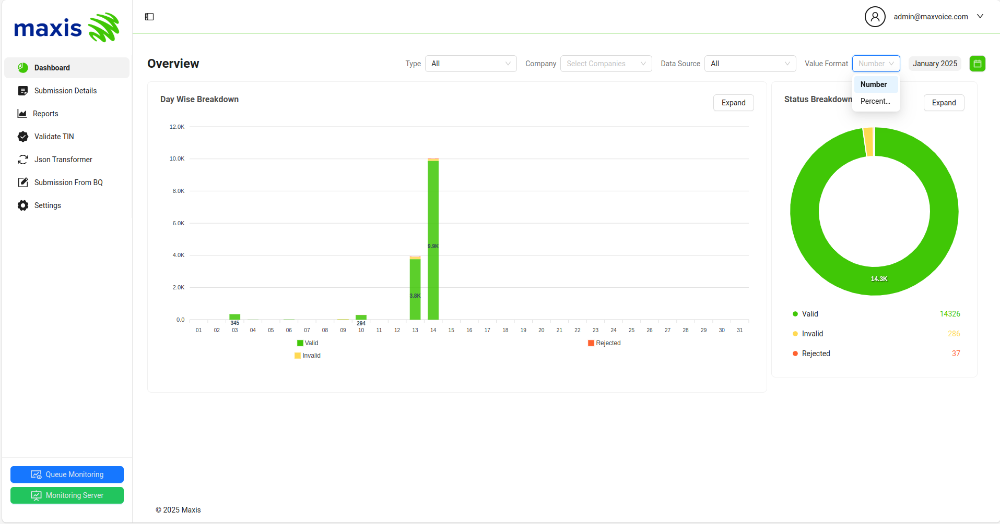
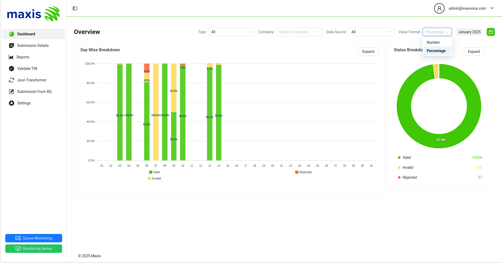
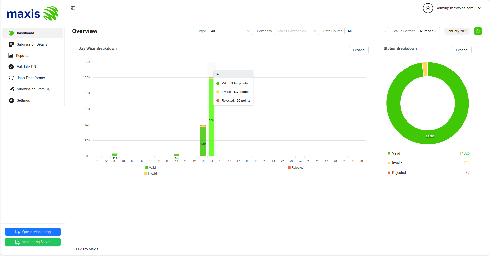
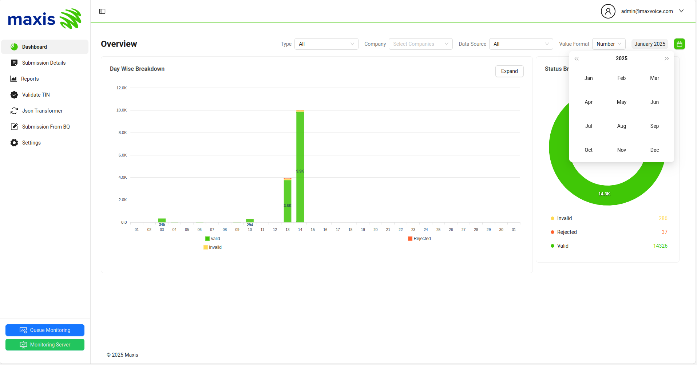
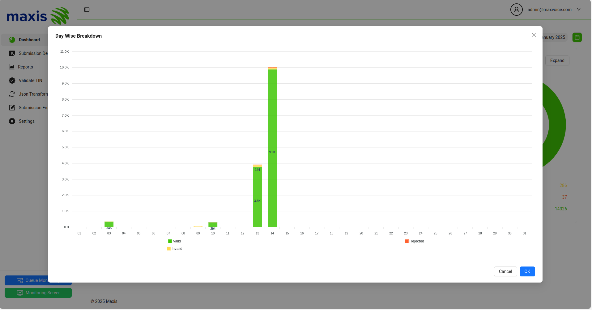
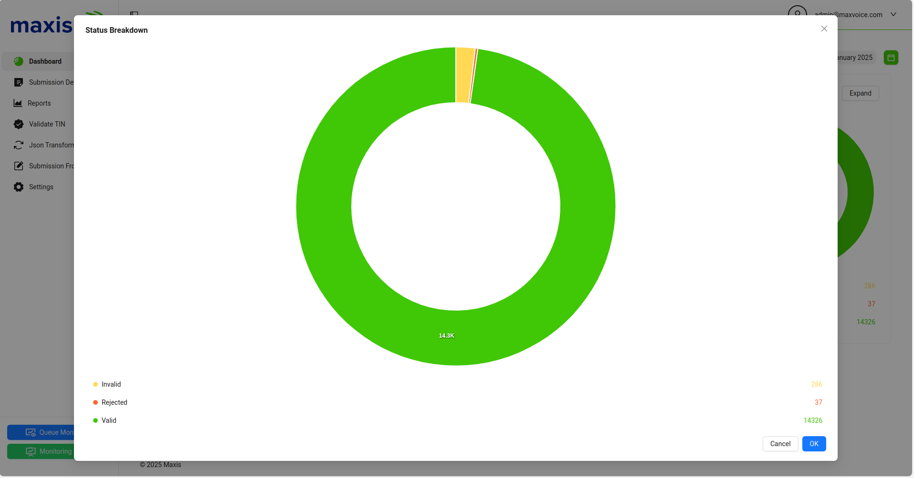

# Dashboard

The Maxis E-Invoice Portal Dashboard provides a comprehensive overview of invoicing activities. It includes various sections and visualizations to help you monitor and manage invoices effectively.

The Dashboard is divided into several key sections:

### Summary Cards

The summary cards at the top of the dashboard provide a quick overview of key metrics such as the total number of invoices, total amount, and other relevant statistics.

### Invoices by Type

This section includes a dropdown selector that allows you to filter invoices by their types (e.g., Individual, Consolidated, All). It helps you quickly identify and analyze the proportion of invoices in each type.

### Invoices by Company Codes

This section includes a dropdown selector that allows you to filter invoices by their company codes (e.g., MYO3, MYO4). It helps you quickly identify and analyze the proportion of invoices by their company codes.

### Invoices by Data Sources

This section includes a dropdown selector that allows you to filter invoices by their data sources(e.g., AMDOCS, KENAN, CHANNEL, SAP). It helps you quickly identify and analyze the proportion of invoices by their data sources.

### Viewing Graph Format

This section includes a dropdown selector that allows you to display the graph in either Number or Percentage format. It helps you quickly identify and analyze the proportion of invoices by their status (e.g., Valid, Invalid, and Rejected).

#### Number Format

When selecting Number, the graph will display values in numerical format (e.g., 100, 1k, 2.5k, 1000k).

#### Percentage Format

When selecting Number, the graph will display values in Percentage format (e.g., 10%, 65%).

#### Graph Status Details

You can see the bar value by hovering over it with your cursor to view the details.

### Recent Invoices by Month

This section allows you to filter and view invoices by a specific month of a year. It helps you analyze invoicing trends and patterns over different months.

### Graph Extend View

By clicking the Extend button of Graph, it displays fullscreen view of that graph showing the count of invoices by their status (e.g., Valid, Invalid, Rejected). 

### Pie Chart Extend View
By clicking the Extend button of Pie Chart, it displays fullscreen view of that pie chart showing the count of invoices by their status (e.g., Valid, Invalid, Rejected).

## Conclusion

The Maxis E-Invoice Portal Dashboard provides a powerful and intuitive interface for monitoring and managing invoicing activities. By utilizing the visualizations and interactive features, you can gain valuable insights into  invoicing performance and make informed decisions to optimize invoicing processes.