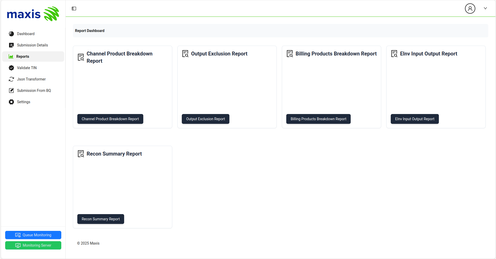

# Report 

The Report section provides an intuitive interface for retrieving report information from the database. It includes dedicated tabs for various types of reports, ensuring easy access and organization.

By clicking on any Report tab black button, you can see the detailed information for that specific report. This feature allows users to quickly navigate and view the data they need without unnecessary steps.

