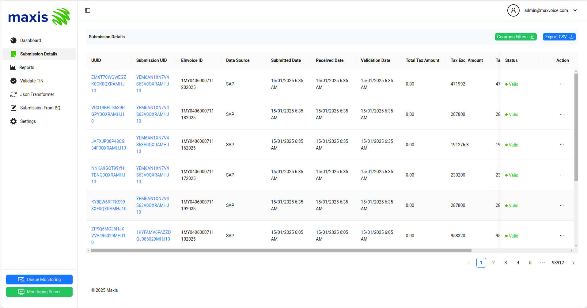
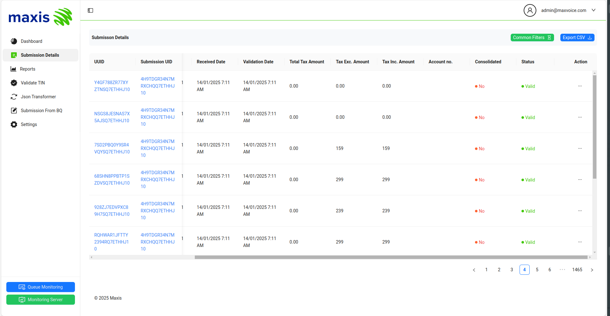
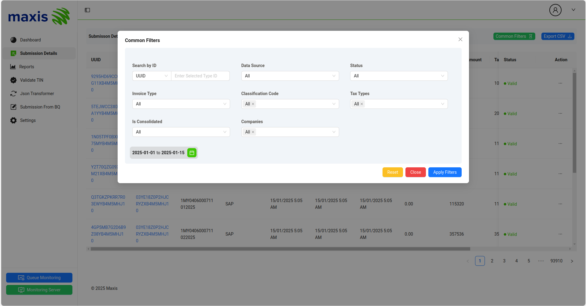
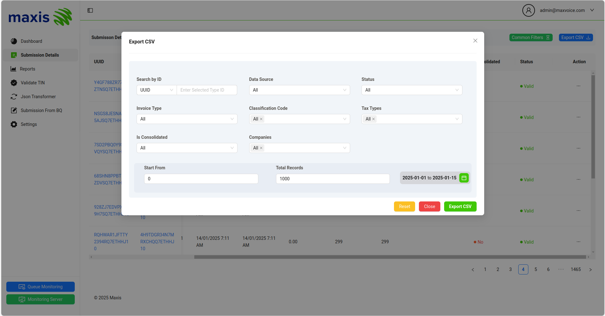
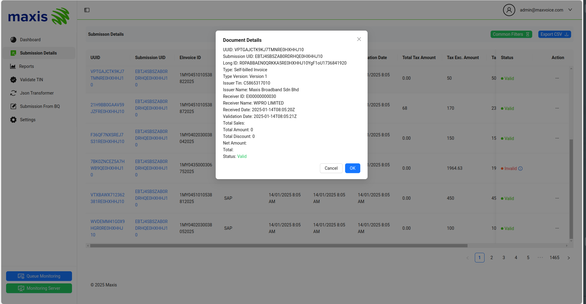
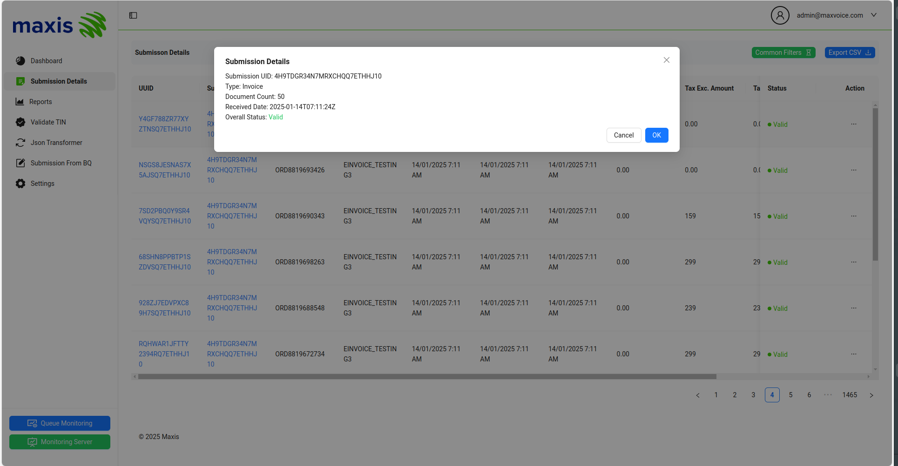
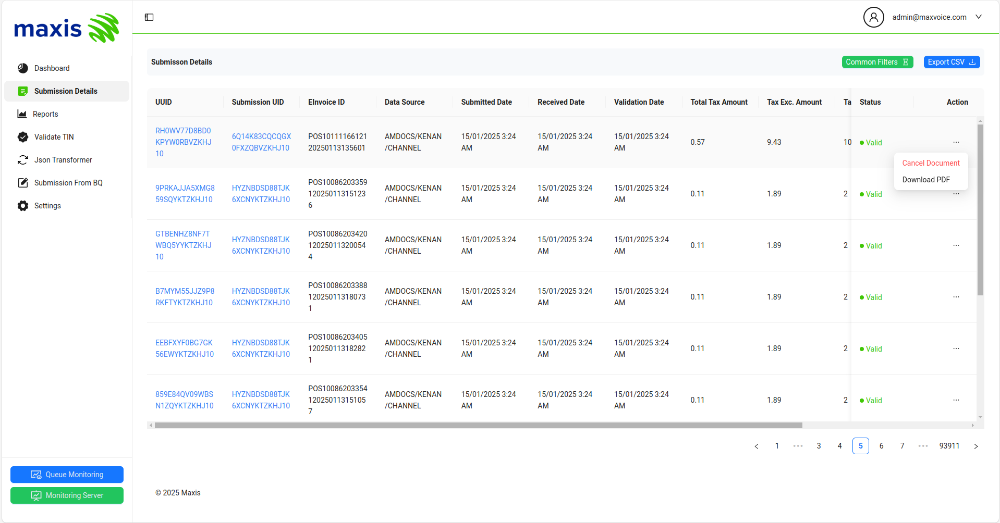
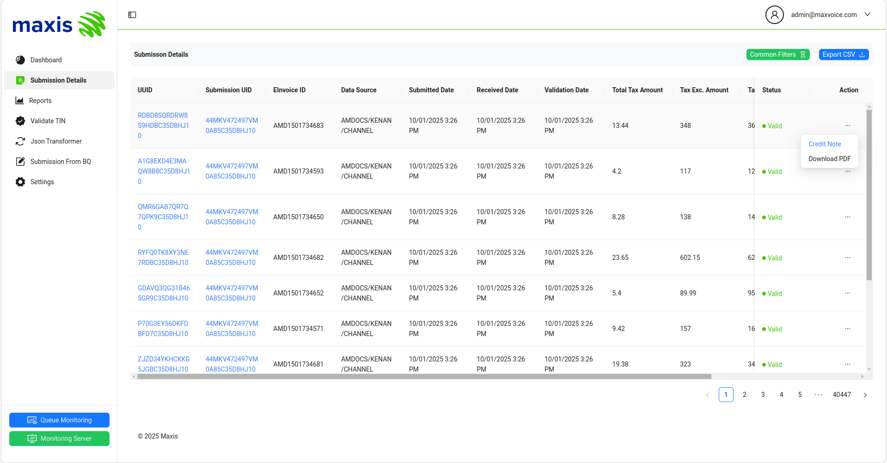

# Submission Details

The Submission Details section offers a detailed overview of invoicing activities, displaying all invoice submissions. This section provides insights into the status of each invoice, including other necessary field of an invoice. 

The Submission Details list can be scrolled horizontally, enhancing the overall view and accessibility of the list.

The Submission Details is divided into several key sections:

### Common Filters

By clicking Common Filters, you can search invoice records by their submitted `UUID`, `Submission UID`, and `EInvoice ID`. You can filter documents by selecting the `Data Source` dropdown (e.g., All, SAP, KENAN, AMDOCS, CHANNEL). Additionally, you can view records by `Status` (e.g., Valid, Invalid, Rejected, Cancelled), `Invoice Types` (e.g., All, Invoice, Debit Note, Credit Note, Self-billed Refund Note), `Classification Code` (e.g., All, Motor Vehicle, Foreign Income, Donation), and `Tax Types` (e.g., All, Tourism Tax, Sales Tax, Service Tax). You can also filter by `Is Consolidated` (e.g., All, Yes, No) and `Company Code` (e.g., MY04, MY05). The date picker field allows you to filter records by date.

### Export CSV

By clicking Export CSV, you can filter invoice records by various criteria such as `UUID`, `Submission UID`, `EInvoice ID`, `Data Source`, `Status`, `Invoice Types`, `Classification Code`, `Tax Types`, `Is Consolidated`, `Company Code`, and `date`, and then download a CSV file based on the filtered records. You can also specify the number of records you need by inserting values in the `Start From` and `Total Records` fields.

### Document Details by UUID

By clicking on the `UUID` of a record, you can view the detailed information of that specific record.This feature allows users to easily access and review the details of individual documents.

### Submission Details by Submission UID

By clicking on a record's `Submission UID` allows you to view detailed information about that specific submission. This feature provides easy access to review the details of individual document submissions.

### Cancel Document

To cancel a document from `IRBM`, click the `Action` dropdown button on the record and select the `Cancel Document` option. This option becomes available `72` hours after the document submission. After this 72-hour window, the cancel document option will be automatically disabled.

### Credit Note

Documents cannot be canceled after `72` hours of submission due to IRBM regulations. If a cancellation is required beyond this window, you must submit a credit note instead. To issue a credit note, click the `Action` dropdown button on the respective record and select the `Credit Note` option. This will automatically generate and submit a credit note to IRBM for the corresponding invoice.

### Download PDF

To download pdf from Portal, click the `Action` dropdown button on the respective record and select the `Download PDF` option. It will download the PDF for the corresponding invoice and switch to new tab to open it.

